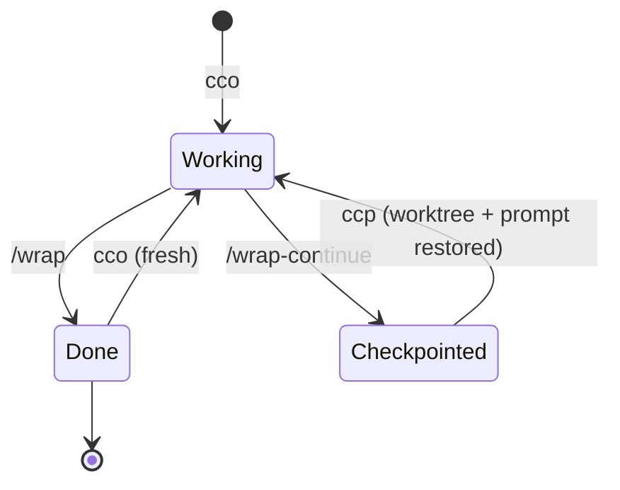
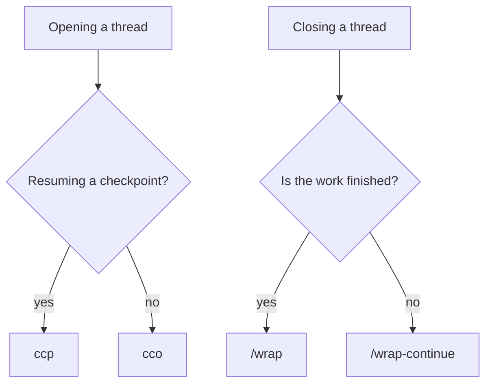

# agent-skills

Skills I use to run Claude Code as a designer. Not a framework: a process snapshot.

---

Every session moves through the same states.



There are two ways out of a session and two ways back in. `/wrap-continue` → `ccp` is the only round trip that preserves the thread, the other exit starts fresh instead of resuming.

---

## At a glance

| Skill | Before → After |
| --- | --- |
| [`/wrap`](#wrap) | Messy end-of-day session → committed, captured, closed |
| [`/wrap-continue`](#wrap-continue) | Context filling up mid-task → committed, closed, hot-resume prompt ready |
| [`/gh-clean-branches`](#gh-clean-branches) | Local branches piling up → stale and merged ones pruned |
| [`/gh-pr-triage`](#gh-pr-triage) | Open PRs in a repo scattered across states → grouped by what needs action |
| [`/gh-fork-sync`](#gh-fork-sync) | Fork drifting behind upstream → synced and pushed to origin |
| [`/gh-stale-issues`](#gh-stale-issues) | Issue list drifted into noise → triaged into ready-to-run commands |
| [`/model-census`](#model-census) | No visibility into which model actually ran → per-thread, per-subagent-type, per-repo report |

---

## What works without adopting my conventions

**Standalone, zero dependencies:** the four `gh-*` skills, plus `/model-census`. The `gh-*` skills reference none of my files or tools, just the `gh` CLI. `/model-census` only needs `python3` and local transcripts — the agent templates and hook it reports on are companions, not prerequisites.

**Self-bootstrapping:** `wrap` and `wrap-continue`. They reference `ORCHESTRATOR.md`, `BACKLOG.md`, `MEMORY.md`, and pickup files, but those are files the skills write, not prerequisites. `BACKLOG.md` gets created if it's missing, the `ORCHESTRATOR.md` step skips itself when the file doesn't exist, Linear and Second Brain are optional steps. Working session hygiene from day one, no setup required.

**Requires the pattern:** the shell launchers. They assume the memory-dir convention and the companion files below. You don't build that convention by hand, the `agent-context` skill generates it, so the sequence is: curl the two companion files, scaffold with `agent-context`, and the rest follows.

The only thing genuinely tied to me is the shape of the convention. Adopt it and everything works, reject it and the first two tiers still run fine.

---

## Install

```bash
npx skills add seansmithworks/agent-skills --list          # browse
npx skills add seansmithworks/agent-skills --skill wrap    # one skill
npx skills add seansmithworks/agent-skills -s '*' -g       # all of them, globally
```

`-a claude-code` targets Claude Code specifically. `-g` installs to `~/.claude/skills` instead of the current project.

The launchers need three companion files that aren't skills, copy them first:

```bash
# Copy the companion files into your Claude config dir
curl -o ~/.claude/orchestrator-prompt.md \
  https://raw.githubusercontent.com/seansmithworks/agent-skills/main/templates/orchestrator-prompt.md
```

```bash
mkdir -p ~/.claude/shell
curl -o ~/.claude/shell/orchestrator.zsh \
  https://raw.githubusercontent.com/seansmithworks/agent-skills/main/shell/orchestrator.zsh
echo 'source ~/.claude/shell/orchestrator.zsh' >> ~/.zshrc
```

The tiers family (model hygiene) needs the four agent templates and the guard hook, copy those too:

```bash
mkdir -p ~/.claude/agents
for f in explore implementer planner strategist; do
  curl -o ~/.claude/agents/$f.md \
    https://raw.githubusercontent.com/seansmithworks/agent-skills/main/templates/agents/$f.md
done

mkdir -p ~/.claude/hooks
curl -o ~/.claude/hooks/model-default-guard.sh \
  https://raw.githubusercontent.com/seansmithworks/agent-skills/main/templates/hooks/model-default-guard.sh
chmod +x ~/.claude/hooks/model-default-guard.sh
```

Register the hook — this needs `jq` (`brew install jq`, or your package manager's equivalent; without it the guard silently no-ops instead of firing).

Add this entry to the `hooks.SessionStart` array in your existing `settings.json` — append, don't replace:

```json
{"type":"command","command":"\"$HOME\"/.claude/hooks/model-default-guard.sh"}
```

Safe merge (keeps any hooks already registered):

```bash
jq '.hooks.SessionStart = ((.hooks.SessionStart // []) + [{"matcher":"","hooks":[{"type":"command","command":"\"$HOME\"/.claude/hooks/model-default-guard.sh"}]}])' ~/.claude/settings.json > /tmp/s.json && mv /tmp/s.json ~/.claude/settings.json
```

---

## Launchers

Two ways to open an orchestrator thread, two ways to close one.

| | Close | Reopen |
| --- | --- | --- |
| Done for the day | `/wrap` | `cco` (clean slate) |
| Not done, out of context | `/wrap-continue` | `ccp` (worktree + prompt restored) |

`/wrap-continue` → `ccp` is the only closed loop of the four: one writes the pickup file, the other consumes it. `ccp` does nothing useful without the `wrap-continue` skill installed.

What each command does:

- **`cco`** loads the orchestrator system prompt; project state arrives through a SessionStart hook.
- **`ccp`** is shorthand for `cco pickup`: restores the worktree and delivers the saved pickup prompt as the new thread's opening message.



Caveats: zsh only, not bash. And if you add your own `cc` shortcut for `claude`, it shadows `/usr/bin/cc`, the system C compiler, in interactive shells — this file deliberately does not ship that alias. Remote control is off by default; `export CCO_REMOTE_CONTROL=1` enables driving the session from claude.ai/code.

---

## What's here

Four families. Eleven skills. All opinionated. Any single skill installs on its own with `--skill <name>`, so the per-skill install command isn't repeated below.

### Wrap family: session hygiene

Every Claude Code session ends the same two ways: you're done for the day, or you're not done but the context window is getting expensive. These are different situations that need different behavior.

### /wrap

`Messy end-of-day session → committed, captured, closed`

**When:** you're done for the day, or longer.
**Does:** runs plan reconciliation (orchestrator threads only), then commits and pushes, updates the ticket tracker, writes hot memories, refreshes orchestrator state, writes session notes, and files long-term notes. No pickup prompt, that's what `/wrap-continue` is for. Every step is optional, it skips what isn't relevant and never forces a commit if nothing changed.

### /wrap-continue

`Context filling up mid-task → committed, closed, hot-resume prompt ready`

**When:** you're recycling a long-lived thread to free context, but the work itself isn't done.
**Does:** commits and pushes (mandatory), saves anything you'd lose on context clear, and generates a hot-resume pickup prompt for the next thread. Light capture, not a retrospective, the goal is a precise handoff, not a full summary.

The distinction matters. Run the heavy end-of-day flow on a continue and you waste the tokens you were trying to save. Run the light continue flow at end-of-day and you lose capture.

The launchers need the companion files copied in Install above. Launch the thread directly with:

```bash
claude --append-system-prompt-file ~/.claude/orchestrator-prompt.md
```

### GH cleanup family: repo hygiene

Repos accumulate debt the same way context windows do, gradually, then all at once. Stale branches, ignored PRs, dusty issues. These four skills clear that debt without ceremony.

### /gh-clean-branches

`Local branches piling up → stale and merged ones pruned`

**When:** your local branch list has drifted, old feature branches are hanging around.
**Does:** detects branches whose remote is gone and feature branches already merged into main, shows a combined list, waits for confirmation, then does a safe delete. Never force-deletes without an explicit nod.

### /gh-pr-triage

`Open PRs in a repo scattered across states → grouped by what needs action`

**When:** you want a status check on your open PRs and the ones waiting on your review.
**Does:** groups PRs into your PRs needing action, PRs waiting on your review, and stale ones (14+ days), with a concrete next-action suggestion per row. Read-only.

### /gh-fork-sync

`Fork drifting behind upstream → synced and pushed to origin`

**When:** your fork's main is behind upstream and you want it caught up.
**Does:** shows how far behind you are, confirms the sync strategy, syncs, and pushes to your origin only. Hard safety rule: never pushes to upstream. That rule exists because of a real incident involving an unintentional PR opened on an upstream repo, the guard is non-negotiable.

### /gh-stale-issues

`Issue list drifted into noise → triaged into ready-to-run commands`

**When:** before a release, after a period of heavy development, or whenever the issue list needs a pass.
**Does:** triages open issues by age and last activity into buckets, no-activity (90d+), no-author-response (30d+), needs labels, needs triage, and generates ready-to-run `gh` commands per issue. Read-only, you run the commands.

### Tiers family: model hygiene

Four agent tiers, pinned once in agent frontmatter instead of decided per spawn. The orchestrator never passes a `model` param to `explore`, `implementer`, `planner`, or `strategist` — each carries its own tier, so routing can't drift task by task. Fable, the top tier, gets a per-task `strategist` seat instead of the main-thread default, because the main thread is the expensive place for a big model to sit — it pays to read every tool output, not just to think. The one skill in this family, `/model-census`, exists because none of the usual cost tools can see any of this: not the API console, not `ccusage`. They see tokens against an API key. They don't see which agent definition ran, or which repo it ran in.

### /model-census

`No visibility into which model actually ran → per-thread, per-subagent-type, per-repo report`

**When:** you want to check tier routing is actually holding, or see where Fable/Opus tokens are going.
**Does:** reads local transcripts (`~/.claude/projects/**`) and reconstructs, per main thread and per subagent, which model actually executed — joining the parent thread's subagent-type declaration to the subagent's own transcript by agent ID, since the two files don't share that link directly. `--brief --since <date>` for the quick version. Flag two things on sight: any Fable or top-tier row in the main-thread table, and a global `model` key in `settings.json` — that's usually `/model <x>` + Enter run without the session-only flag, and it silently taxes every session after. Token counts reported are raw, not dollars.

On my machine, across ~1,500 subagent runs in a month, every run of the three pinned agents landed on its pinned model unless the caller passed an explicit `model` override — routing never leaked on its own. The cost leak was the main thread: `/model <x>` + Enter silently saves a global default. The SessionStart guard catches that.

---

## My stack (so you know what to swap)

These skills reference my specific setup. Here's what that means and what you'd swap:

| My tool                             | What it does                        | Swap for                                                                      |
| ------------------------------------ | ------------------------------------ | ------------------------------------------------------------------------------ |
| Linear                              | Ticket tracker                      | GitHub Issues, Jira, Notion, etc.                                             |
| Second Brain / QMD                  | Long-term searchable notes          | Obsidian, Notion, your notes system                                           |
| ORCHESTRATOR.md                     | State file for orchestrator threads | Optional, only relevant if you use the orchestrator pattern                   |
| `.claude/projects/*/memory/`        | Per-project memory dir              | Optional, Claude Code memory convention                                      |
| `~/.claude/orchestrator-prompt.md`  | Orca system prompt                  | Required for the launchers, copy from `templates/`                     |
| `~/.claude/projects/SCAFFOLDING.md` | Per-project scaffold version index  | Used by the `agent-context` skill, create manually |

The gh cleanup skills are stack-agnostic. The wrap skills work without Linear or Second Brain, just skip those steps. The orchestrator skills require the two template files above.

---

## Skills ecosystem

These skills are built for the [open agent skills ecosystem](https://skills.sh/). Any SKILL.md-compatible harness can use them.

Browse more skills at [skills.sh](https://skills.sh/).

---

## License

MIT, see [LICENSE](LICENSE).
